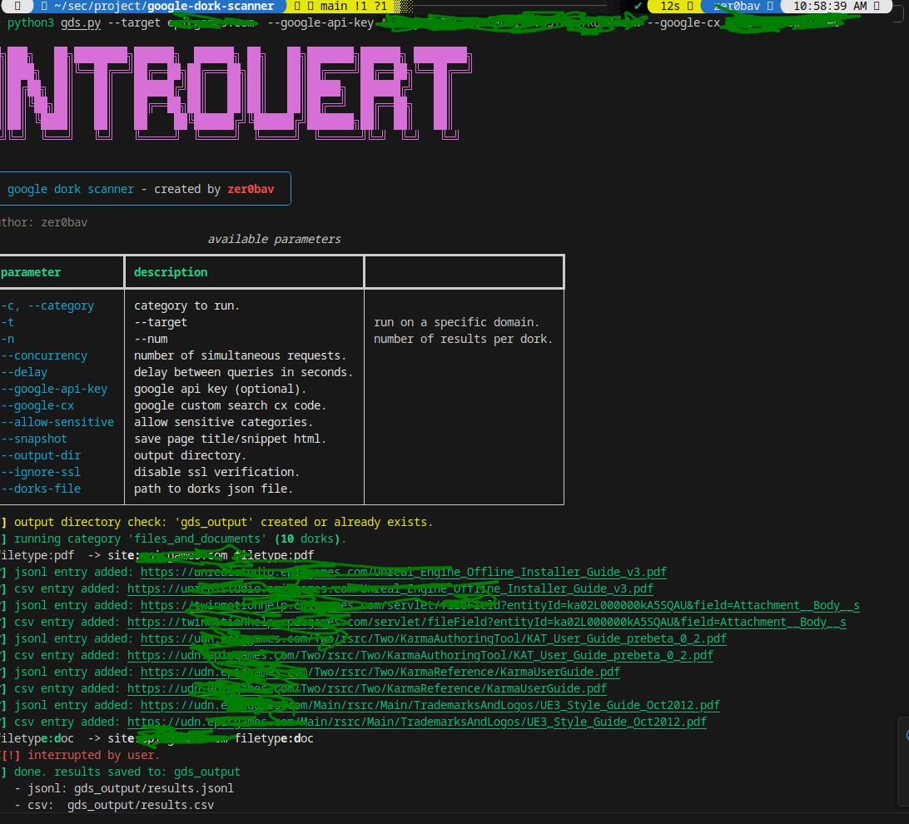
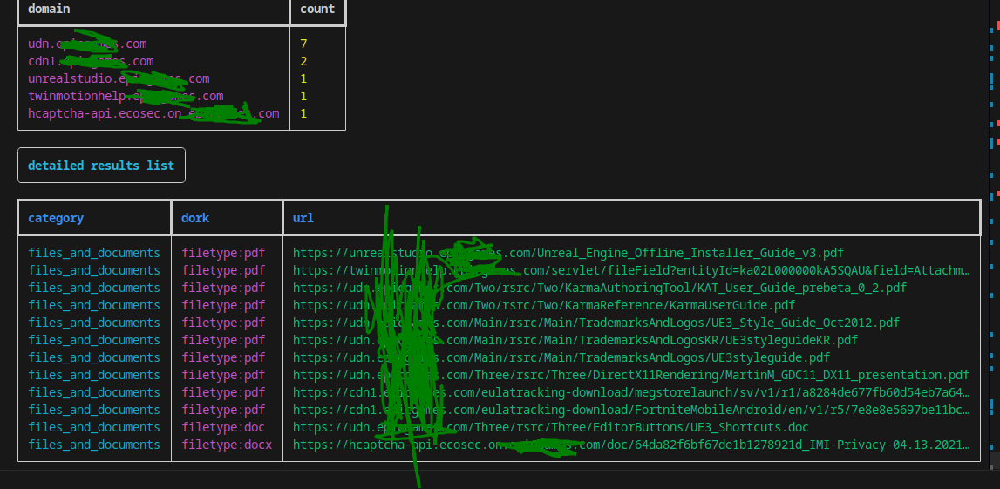
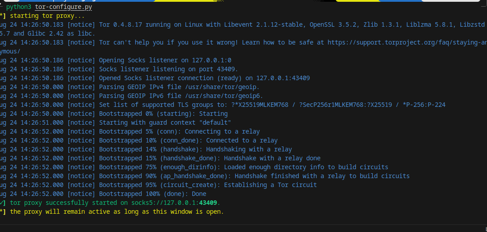

# Google Dork Scanner (GDS)

**Author:** zer0bav
**Created by:** zer0bav

Google Dork Scanner (GDS) is a tool designed for ethical use, allowing you to search for specific content and potentially sensitive information on the web using dorks. The results can also be analyzed using the `analyze.py` script.

---

## Features

* Load dorks from a JSON file (`dorks.json`)
* Search via Google Custom Search API or DuckDuckGo HTML scraping
* Async/concurrent searches with rate-limiting (delay)
* Proxy support (HTTP/HTTPS)
* Scope searches to a specific domain (`site:` prefix)
* Skip sensitive categories or allow them with `--allow-sensitive`
* Save results to JSONL and CSV
* Optional HTML snapshot capture
* Analysis script provides summary statistics

---

## Requirements

* Python 3.10+
* Required Python packages:

```bash
pip install aiohttp beautifulsoup4 rich brotli setuptools wheel  
```

* Optional (for Google CSE):

  * Google API key
  * Custom Search Engine (CX) code

---

## Installation

1. Clone the repository:

```bash
git clone https://github.com/zer0bav/Google-Dorks-Scanner.git
cd Google-Dorks-Scanner
```

2. Install dependencies:

```bash
pip install -r requirements.txt
```

3. Customize `dorks.json` or use the provided examples.

4. setup tool with `pyproject.toml`

```bash
pip install .
```


---

## Usage

### Run GDS

```bash
python gds.py -c files -t example.com -n 10 --snapshot
```
or

```bash
gdscanner -c files -t example.com -n 10 --snapshot
```


Parameters:

| Parameter         | Description                         |
| ----------------- | ----------------------------------- |
| -c, --category    | The dork category to run            |
| -t, --target      | Limit search to a specific domain   |
| -n, --num         | Number of results per dork          |
| --concurrency     | Number of concurrent requests       |
| --delay           | Delay between searches (seconds)    |
| --google-api-key  | Google API key (optional)           |
| --google-cx       | Google Custom Search CX code        |
| --allow-sensitive | Allow sensitive categories          |
| --snapshot        | Capture HTML snapshots of results   |
| --output-dir      | Output directory                    |
| --ignore-ssl      | Ignore SSL certificate verification |
| --dorks-file      | Path to dork JSON file              |
| --tor             | Route traffic through tor.          |
| --tor-port        | tor socks proxy port (default: 9050)|
### Example:

```bash
python gds.py -c login_and_admin_panels -t example.com -n 5 --allow-sensitive
```

---

### Analysis


To analyze results, use `analyze.py`:

```bash
python analyze.py
```

The analysis script:

* Reads JSONL or CSV result files
* Counts results per category
* Reports if sensitive data was found
* Lists the most frequent domains
* Generates summary statistics

---

## Output

* JSONL: `gds_output/results.jsonl`
* CSV: `gds_output/results.csv`
* Snapshots (optional): `gds_output/snapshots/`

---

## Disclaimer

* This tool is intended for ethical and authorized use only.
* Collecting sensitive data without permission may have legal consequences.
* The `--allow-sensitive` parameter should only be used by experienced users.


## Example

#### gds.py



#### analyze.py


#### tor-configure.py


---

## License

MIT License
